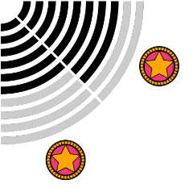
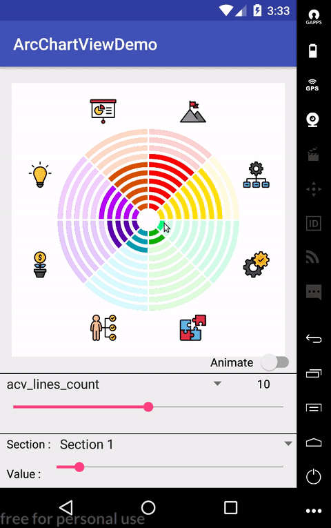
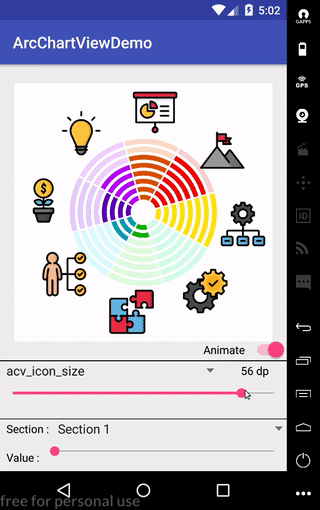
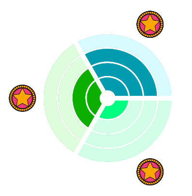
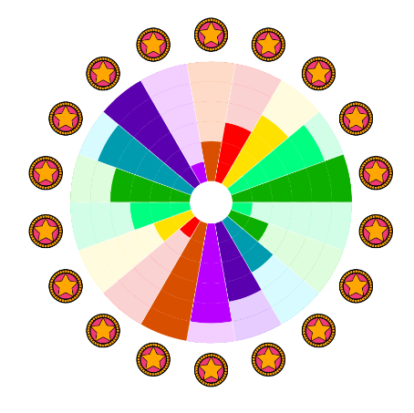
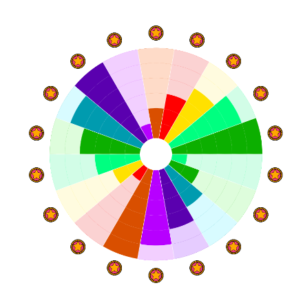
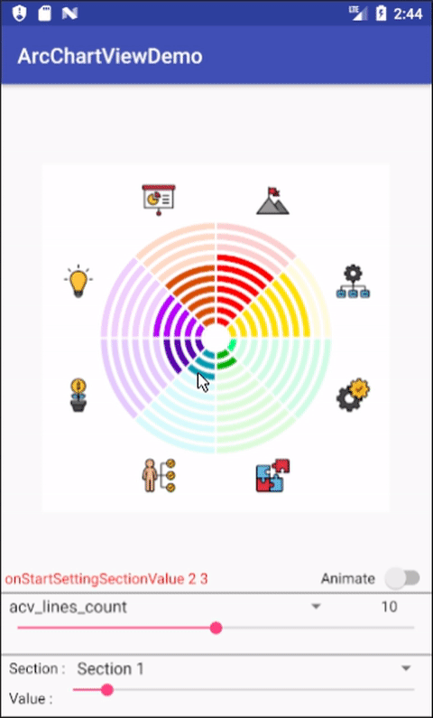

[](https://opensource.org/licenses/Apache-2.0)
[](https://github.com/imaNNeoFighT/ArcChartView/raw/master/repo_files/AcvDemo-1-0-2.apk)
[](https://jitpack.io/#imaNNeoFighT/ArcChartView)
[]( https://android-arsenal.com/details/1/6599 )

# ArcChartViewDemo

You can use this library to draw Arc charts

and show your statistics or anything you want

or maybe get some ratings from user.

you can download the [Demo apk file](https://github.com/imaNNeoFighT/ArcChartView/raw/master/repo_files/AcvDemo-1-0-2.apk) (you can first adjust your Chart in the app and then implement it in code)


## 1 - Getting Started

By this instructions you can add this library and i will explain how use it.


### Add Maven to your root build.gradle

First of all Add it in your root build.gradle at the end of repositories:

```
allprojects {
  repositories {
    ...
    maven { url 'https://jitpack.io' }
  }
}
```

### Add Dependency

Add the dependency to your app build.gradle file

```
dependencies
{
    implementation 'com.github.imaNNeoFighT:ArcChartView:1.0.3'
    // Or in older versions : 
    // compile 'com.github.imaNNeoFighT:ArcChartView:1.0.3'
}
```

And then sync your gradle and take a tea.


## 2 - About The View
You can simply use this View like other Views in android,
just add ``ArcChartView`` in your java code or xml.

## View Properties 

you can customize StepBarView, all of this attributes can change via xml or code (runtime)
  
|Attribute|Type|Kotlin|Description|
|:---:|:---:|:---:|:---:|
|acv_lines_count|Integer|`linesCount`|lines count of chart (i mean arc lines), default value is `10`|
|acv_lines_space|Dimensions|`linesSpace`|lines space (lines margin), default value is `4dp`|
|acv_lines_width|Dimensions|`linesWidth`|lines width , default value is `6dp`|
|acv_sections_count|Integer|`sectionsCount`|sections count , default value is `8`|
|acv_sections_space|Dimensions|`sectionsSpace`|sections space (sections margin) , default value is `4dp`|
|acv_mid_start_extra_offset|Dimensions|`midStartExtraOffset`|center extra offest size, default value is `16dp`|
|acv_icon_size|Dimensions|`iconSize`|the icons size, default value is `32dp`|
|acv_start_degree_offset|Float|`startDegreeOffset`|offset of start degree to design the view, default value is `0f`|
|acv_allow_setting_value_by_touch|Boolean|`allowSettingValueByTouch`|disable or enable allow setting value by touch feature, default value is `true`|
|acv_allow_animations_on_set_values|Boolean|`allowAnimationsOnSetValue`|disable or enable allow play animation on setting values, default value is `true`|


## set and get Sections value
keep in mind that sections position starts with 0

to get a section value use this function
```kotlin
value = myArcChartView.getSectionValue(sectionPos)
```


and to set a section value use this function
```kotlin
myArcChartView.getSectionValue(sectionPos,sectionValue)
```


## change filled and unFilled colors
to set the unFilled color (the section color that drawn behind) use this function
```kotlin
myArcChartView.setFilldeColor(sectionPos, Color.BLACK)
```

and to set the filled color (the section color that drawn in top) use this function
```kotlin
myArcChartView.setUnFilldeColor(sectionPos,Color.LTGRAY)
```




## change section icons
to set the icons use this function
```kotlin
myArcChartView.setSectionIcons(sectionIcons : MutableList<Bitmap?>)
```


## View listener (ArcListener)
you can handle some actions (only sectionsIconClick for now)
just set a listener and make your logic
```kotlin
myArcChartView.listener = object : ArcChartView.AcvListener {
            override fun onSectionsIconClicked(sectionPos: Int) {
                //Handle Your Logic Here
                Toast.makeText(applicationContext, sectionPos.toString(),Toast.LENGTH_SHORT).show()
            }
        }
```


## setValueByTouch (and callback)
You can set values by touch and you can disable this feature by 'acv_allow_setting_value_by_touch' attribute.
Also you can set a callBack listener to find out when values changed.
```kotlin
myArcChartView.listener = object : ArcChartView.AcvListener {
            override fun onStartSettingSectionValue(sectionPos: Int, sectionValue: Int) {
                tvSectionsValue.setText("onStartSettingSectionValue $sectionPos $sectionValue")
            }

            override fun onContinueSettingSectionValue(sectionPos: Int, sectionValue: Int) {
                tvSectionsValue.setText("onContinueSettingSectionValue $sectionPos $sectionValue")
            }

            override fun onFinishedSettingSectionValue(sectionPos: Int, sectionValue: Int) {
                tvSectionsValue.setText("onFinishedSettingSectionValue $sectionPos $sectionValue")
            }
        }
```



## Implementing Rotate Animation (using startDegreeOffset attribute)
```kotlin
    val anim = ValueAnimator.ofFloat(0f,360f).apply {
                repeatCount = ValueAnimator.INFINITE
                repeatMode = ValueAnimator.RESTART
                interpolator = OvershootInterpolator()
                duration = 3000
            }
            anim.addUpdateListener {
                if(isAnimating)
                    myArcChartView.startDegreeOffset =
                            it.animatedValue as Float
            }
            anim.start()
```



## 3 - Some Samples

### Sample 1

```xml
    <com.neo.arcchartview.ArcChartView
        android:id="@+id/arc_chart_view"
        android:layout_width="wrap_content"
        android:layout_height="wrap_content"
        app:layout_constraintBottom_toTopOf="@+id/view_separator"
        app:layout_constraintLeft_toLeftOf="parent"
        app:layout_constraintRight_toRightOf="parent"
        app:layout_constraintTop_toTopOf="parent"
        app:acv_lines_count="10"
        app:acv_lines_width="6dp"
        app:acv_lines_space="4dp"
        app:acv_sections_count="8"
        app:acv_sections_space="2dp"
        app:acv_icon_size="32dp"
        app:acv_mid_start_extra_offset="12dp"
        />
```



### Sample 2

```xml
    <com.neo.arcchartview.ArcChartView
        android:id="@+id/arc_chart_view"
        android:layout_width="wrap_content"
        android:layout_height="wrap_content"
        app:layout_constraintBottom_toTopOf="@+id/view_separator"
        app:layout_constraintLeft_toLeftOf="parent"
        app:layout_constraintRight_toRightOf="parent"
        app:layout_constraintTop_toTopOf="parent"
        app:acv_lines_count="4"
        app:acv_lines_width="17dp"
        app:acv_lines_space="2dp"
        app:acv_sections_count="3"
        app:acv_sections_space="6dp"
        app:acv_icon_size="36dp"
        app:acv_mid_start_extra_offset="0dp"
        />
```



### Sample 3

```xml
    <com.neo.arcchartview.ArcChartView
        android:id="@+id/arc_chart_view"
        android:layout_width="wrap_content"
        android:layout_height="wrap_content"
        app:layout_constraintBottom_toTopOf="@+id/view_separator"
        app:layout_constraintLeft_toLeftOf="parent"
        app:layout_constraintRight_toRightOf="parent"
        app:layout_constraintTop_toTopOf="parent"
        app:acv_lines_count="6"
        app:acv_lines_width="14dp"
        app:acv_lines_space="0dp"
        app:acv_sections_count="18"
        app:acv_sections_space="0dp"
        app:acv_icon_size="14dp"
        app:acv_mid_start_extra_offset="8dp"
        />
```



### Sample 4

```kotlin
    myArcChartView.allowAnimationsOnSetValue = true 
```



<!--- <a href='https://ko-fi.com/M4M67AFG' target='_blank'></a> --->


# License
```
Copyright 2018 Iman Khoshabi

Licensed under the Apache License, Version 2.0 (the "License");
you may not use this file except in compliance with the License.
You may obtain a copy of the License at

    http://www.apache.org/licenses/LICENSE-2.0

Unless required by applicable law or agreed to in writing, software
distributed under the License is distributed on an "AS IS" BASIS,
WITHOUT WARRANTIES OR CONDITIONS OF ANY KIND, either express or implied.
See the License for the specific language governing permissions and
limitations under the License.
```